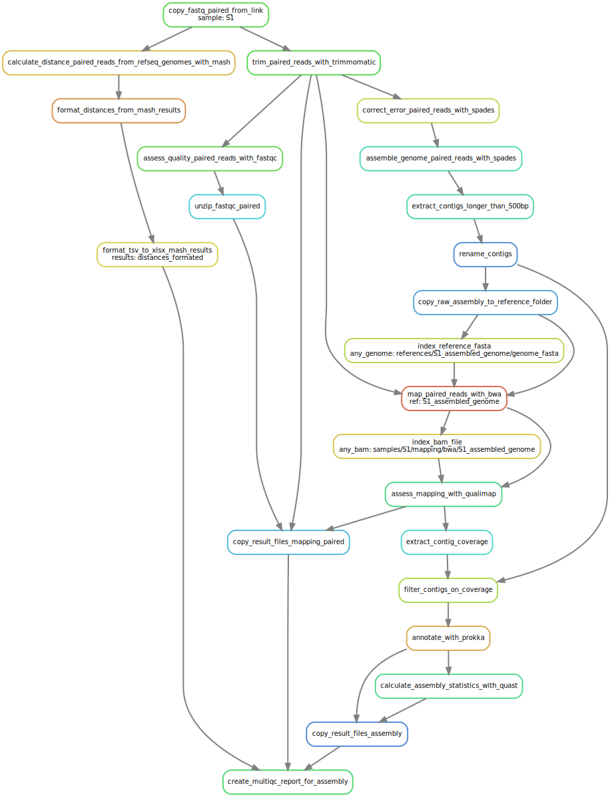

.. _assembly_quality:

====================
Assembly and quality
====================

Aggregates rules for assembling genomes and performing various quality control checks.

.. _assembly_dag:

----------
Parameters
----------

* ``cov_cutoff``: contigs whose coverage is below this cutoff will be excluded from the final assembly
* ``adapter_file_name``: look for the adaptor for this library preparation kit (possible `values <https://github.com/timflutre/trimmomatic/tree/master/adapters>`_)
* ``adapter_removal_param1``, ``adapter_removal_param2``, ``adapter_removal_param3``: parameters for adapter trimming (`reference <http://www.usadellab.org/cms/index.php?page=trimmomatic>`_)
* ``minimum_quality_base``: leading and trailing bases below this quality will be removed
* ``minimum_read_length``: reads shorter than this threshold after trimming will be discarded (be careful when using reads from SRA!)

------------
Deliverables
------------
 
* ``quality/multiqc/assembly/multiqc_report.html``: quality control report based on the results of **fastqc**, **trimmomatic**, **qualimap**, **quast** and **prokka** for every sample
* ``samples/{sample_name}/annotation/``: folder containing all annotation files from **prokka**
* ``contamination/distances_formated.xlsx``: mash distances to all RefSeq genomes, ordered by significance, for each sample

