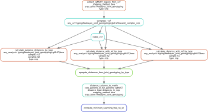
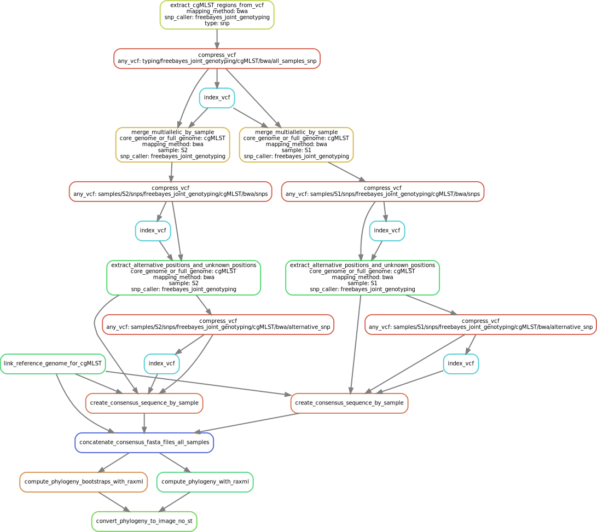

.. _epidemiology:
   
Epidemiology
============

Depends on the :ref:`assembly_quality` workflow (for determining the Sequence Types).
The genotyping results depend on the quality assessment performed on the mapping to the reference genomes, thus each time genotyping is performed, a Multiqc report is available in ``quality/multiqc/mapping_to_{ref}/multiqc_report.html`` and the contamination results in ``contamination/distances_formated.xlsx`` for each sample.

----------
Parameters
----------

* ``minimum_coverage_for_calling``: minimum of coverage for considering a genomic position when counting differences between samples. Any position (whether the genotype is identical to the reference, ie `GT=0` in the vcf, or different, ie `GT=1`) having a lower coverage will be masked.
* ``minimum_alternate_fraction_for_calling``: minimum ratio of observations favouring an alternative allele over observations favouring the reference allele. Any position (`GT=0` or `GT=1`) not meeting this criteria will also be masked.
* ``snp_threshold``: pairs of samples having less than this number of SNP differences will be linked in the final minimum spanning tree
* ``minimum_spanning_tree_size``: size of the minimum spanning tree image, default is ``10``
* ``phylogeny_image_size``: size of the phylogeny image, default is ``800``
* ``species``
  
--------------------
Available Genotypers
--------------------

Genotyping can be performed with two different softwares:
  
.. toctree::
   :glob:

   genotypers/*

---------      
Filtering
---------

.. toctree::
   :glob:
   
   filtering/*

-----------------------
Calculating differences
-----------------------

   Calculating differences between pairs of samples and samples and reference
	    
After the filtering has been performed, differences in snps are calculated between samples and against the reference. Every comparison is pairwise. At each position, if any of the two genotype is unknown because of the filtering (``GT="."``), this position will not be counted as a difference. Once every distances have been computed, they are agregated in a single file, transformed to a matrix and finally to a minimum spanning tree image with the ``igraph`` R package.

---------
Phylogeny
---------

   Steps to create phylogeny from the filtered genotype positions

After the filtering has been performed, the SNPs of each samples are replaced in the reference fasta file. However, the unknown positions are replace with ``N``. Every sequence is then concatenated and a simple phylogeny is calculated with RAxML, without partitions, with the GTRCAT model.

------------
Deliverables
------------

.. include:: epidemiology_deliverables.rst

