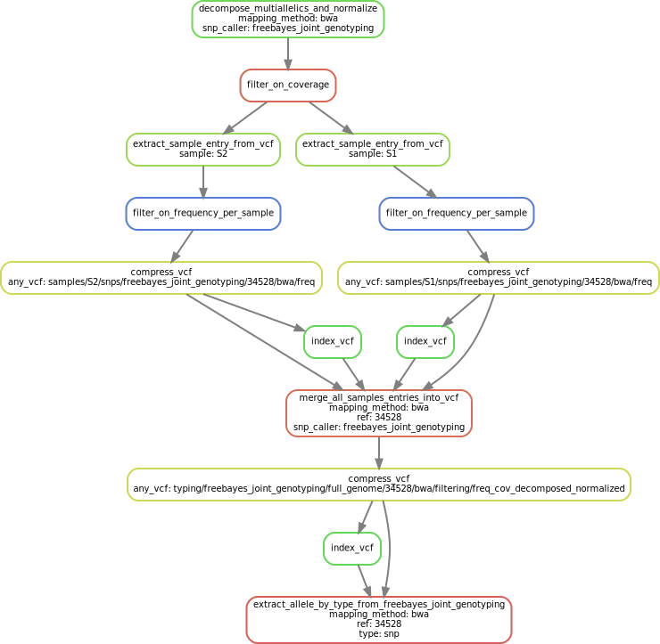

.. _filtering:

.. _filtering_dag:

   Overview of the filtering process

==================
Coverage filtering
==================

All positions in every sample are filtered simultaneously, whether the genotype if REF or ALT in VCF, will be masked (genotype is set to unknown, ``GT=.``) will be masked if the coverage is lower than ``minimum_coverage_for_calling``.

===================
Frequency filtering
===================

Filtering over the frequency of observation at each position is processed separately for each sample. Multiallelic entries from the VCF are splitted and normalized with `vt <https://genome.sph.umich.edu/wiki/Vt>`_. Then, for alternative genotype entries, the genotype is set to unknown if the ratio of observation of ALT (``FORMAT/AD[0:1]`` in the VCF) over the total coverage of the position (``FORMAT/DP``) is lower than ``minimum_alternate_fraction_for_calling``. Similarly, for reference genotype entries, the genotype is set to unknown if the ratio of the number of observations of REF (``FORMAT/AD[0:0]``) over the total coverage of the position (``FORMAT/DP``) is lower than ``minimum_alternate_fraction_for_calling``. After the filtering is done, all samples are merged back together in the same VCF.

==============
Type filtering
==============
Entries in the VCF are filtered according to their type. We preferentially keep only entries defined as single nucleotide polymorphisms.

