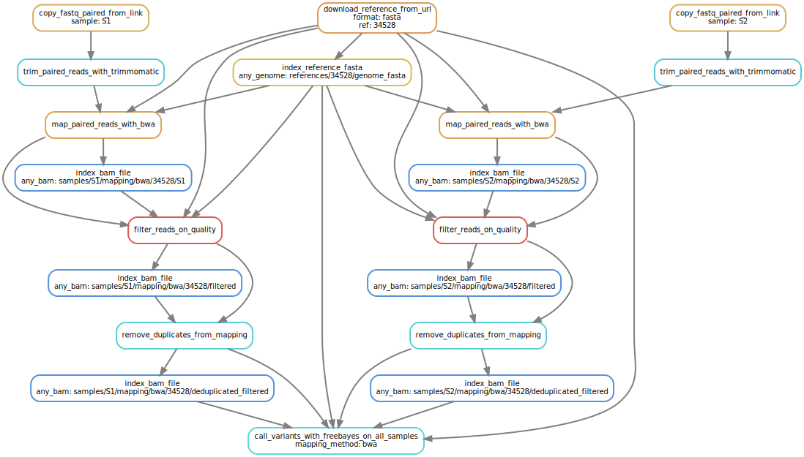
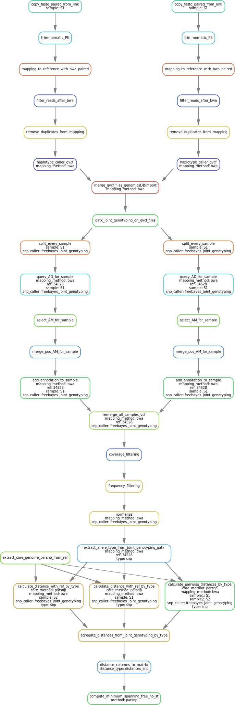

.. _snp_callers:

===========
SNP callers
===========

.. _freebayes:

Freebayes
=========
Genotyping with Freebayes is done at the same time for all samples. This will enable us to keep coverage informations that we will need during the filtering steps.

.. _freebayes_dag:

   Simplified Directed Acyclic Graph (DAG) for Freebayes SNP calling and distance calculation
	    
.. _gatk:

GATK
====

Genotyping with GATK is done in two pass. First, ``HaplotypeCaller`` is called on every sample using the option ``--ERC BP_RESOLUTION``. The resulting gVCF file then contains the SNP calls plus the coverage at every position of the reference genome. Once every sample has been called with ``HaplotypeCaller``, the gVCFs are merged (with ``GenomicsDBImport``) and the final vcf file is obtained with ``GenotypeGVCFs``. Using ``--ERC BP_RESOLUTION`` enables us to keep the coverage information for each sample, at positions where SNPs were called in other samples. This information will be needed at the filtering step.

.. _gatk_dag:

   Simplified Directed Acyclic Graph (DAG) for GATK (HaplotypeCaller and GenotypeGVCFs) SNP calling and distance calculation
	    

