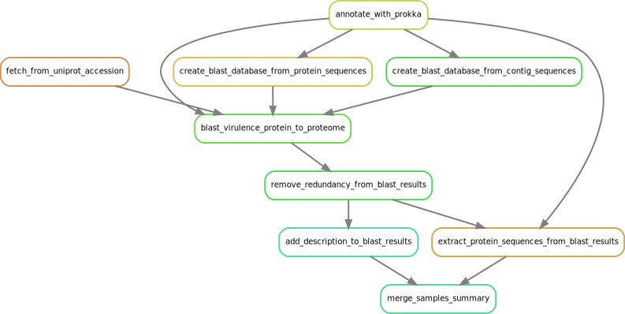

.. _virulence:
  
Virulence
=========

Depends on the :ref:`assembly_quality` workflow.

   Steps to identify virulence factors

After the annotation of the genome, virulence factors are search by two different ways:

* Factors longer than 50 amino acids are search by ``blastp`` over the proteome annotated by prokka
* Factors shorter than 50 amino acids are search by ``tblastn`` directly over the contigs of the assembly

----------
Parameters
----------

* ``virulence_factors``: file with list of uniprot accession of virulence factors. An example is available in the folder ``data/staph/db/``
  
.. csv-table:: Virulence data example 
   :header: "gene","uniprot_accession","description"

   "hla","P09616","Alpha-hemolysin"
   "hld","P0C1V1","Delta-hemolysin"
   "hlgA","P0A074","Gamma-hemolysin component A"
   "hlgB","P0A077","Gamma-hemolysin component B"

* ``virulence_percentage_identity_cutoff``: amino acid identity cut off for considering a match
* ``virulence_coverage_cutoff``: coverage cut off for considering a match

------------
Deliverables
------------

*  ``virulence_summary.xlsx``: summary of virulence proteins found in every samples (one per sheet).
